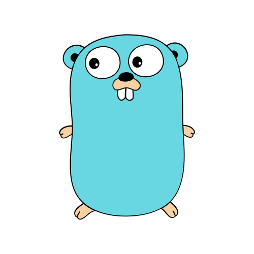

<!--
**majidmvulle/majidmvulle** is a ✨ _special_ ✨ repository because its `README.md` (this file) appears on your GitHub profile.

Here are some ideas to get you started:

- 🔭 I’m currently working on ...
- 🌱 I’m currently learning ...
- 👯 I’m looking to collaborate on ...
- 🤔 I’m looking for help with ...
- 💬 Ask me about ...
- 📫 How to reach me: ...
- 😄 Pronouns: ...
- ⚡ Fun fact: ...
-->

## Olà 

I am a Senior Solutions Architect 💡👷🏽‍♂️, Software Developer 👨🏾‍💻 and Technical Team Lead 👨🏾‍💼 based in Lisbon, Portugal.

I am passionate about technology and currently pursuing the [AWS Certified Solutions Architect - Professional](https://aws.amazon.com/certification/certified-solutions-architect-professional/) and [TOGAF Enterprise Architecture Practitioner](https://www.credly.com/org/the-open-group/badge/the-open-group-certified-togaf-enterprise-architecture-practitioner) certifications.

## 💬 Ask me about: 

* Solution Architecture
* Cloud Infrastructure
* Migration (legacy monolithic to microservices)
* General software development best practices

## 🔧 Technologies & Tools
Here are some of the technologies and tools of choice when architecting solutions.  

 &nbsp;&nbsp;
&nbsp;&nbsp;
&nbsp;&nbsp;
&nbsp;&nbsp;
&nbsp;&nbsp;

  

* [Swagger/OpenAPI v3.1.0](https://spec.openapis.org/oas/latest.html) - For API documentation
* [AsyncAPI](https://www.asyncapi.com/en) - For event-driven architecture API documentation
* [Structurizr (C4 models)](https://structurizr.com/) - Solution Architecture illustration
* [OpenFGA](https://openfga.dev/) - For authorization
* [Temporal](https://temporal.io/) - For workflow orchestration in a distributed, event-driven microservices environment
* [AWS](https://aws.amazon.com/) - For cloud deployment, including some of the core services like ECS (Fargate) for compute, Cognito for authentication, Aurora for ACID strorage, MSK & Glue if using Kafka, DocumentDB or DynamoDB for NoSQL storage, S3 with CloudFront, etc
* [Terraform/OpenTofu](https://opentofu.org/) - For IaC

## 📫 How to reach me: 
You can find me on: 

<a href="https://www.linkedin.com/in/majidmvulle">

/in/majidmvulle</a>. 

You could also schedule a call with me on:

<a href="https://calendar.app.google/wkJ8by5mRyByiShr6">

https://calendar.app.google/wkJ8by5mRyByiShr6

## &#x1f4c8; GitHub Stats

  

  

***See for yourself!!!***

------ The End ------

<!-- Resources -->
<!-- Icons: https://simpleicons.org/ -->
<!-- GitHub Stats: https://github.com/anuraghazra/github-readme-stats -->
<!-- Emojis: https://emojipedia.org/emoji/ -->
<!-- HTML Emojis: https://www.fileformat.info/index.htm -->
<!-- Shields: https://shields.io/ -->
<!-- Awesome GitHub Profile README: https://github.com/abhisheknaiidu/awesome-github-profile-readme -->

